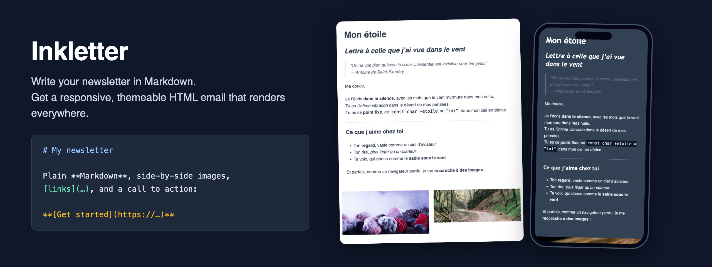

# Inkletter

[](https://github.com/lpauloin/Inkletter)
[](https://github.com/lpauloin/Inkletter/actions/workflows/ci.yml)
[](https://badge.fury.io/py/inkletter)
[](https://opensource.org/licenses/MIT)



**Write your emails like prose, send them like a pro.**

Inkletter turns plain Markdown files into beautiful, responsive MJML and HTML email
layouts, ready to be previewed, shared or sent to the world.

## Why Inkletter?

Because writing HTML emails by hand is like ironing socks: pointless and painful.

With Inkletter, you write your content in **Markdown** (like a decent human being),
and it becomes a **gorgeous, mobile-friendly HTML email** powered by MJML.

## Features

- Markdown to MJML or to final responsive HTML, in one command
- Layout from plain Markdown structure: side-by-side image rows, image-beside-text
  media objects, and call-to-action buttons from a lone bold link
- Seven built-in themes, or your own theme in a small TOML file
- Django template tags kept intact, to use Inkletter as a build step
- Live preview in your browser, with a device simulator (iPhone, iPad, desktop)
- Clean Python API if you'd rather script it
- Runs entirely on your machine, no account, no vendor lock-in

## Installation

Python 3.10+ required.

```bash
pip install inkletter
```

Or for development:

```bash
git clone https://github.com/lpauloin/Inkletter.git
cd Inkletter
pip install -e .
```

## Usage

### Preview a Markdown file as a responsive email

```bash
inkletter preview newsletter.md
```

Opens a split view in your browser: your Markdown, the generated MJML, and the
rendered email in a device simulator.

### Convert to HTML

```bash
inkletter md2html newsletter.md -o newsletter.html --view
```

Writes the final email HTML, and opens it in your browser with `--view`.

### Export the raw MJML

```bash
inkletter md2mjml newsletter.md -o newsletter.mjml
```

Without `-o`, the MJML is printed to stdout, ready to be piped anywhere.

### Plain-text version

```bash
inkletter md2txt newsletter.md -o newsletter.txt
```

The plain-text alternative for `multipart/alternative` sending — better
deliverability, and a readable email everywhere. Headings are underlined,
links become `label <url>`, buttons become `→ label : url` call-to-action
lines, and tables are ASCII-aligned.

## Django templates

Building emails for a Django app? Pass `--django` and the tags survive
the conversion, so the output is itself a Django template:

```bash
inkletter md2html welcome_email.md --django -o templates/welcome_email.html
inkletter md2txt  welcome_email.md --django -o templates/welcome_email.txt
```

```markdown
# Welcome aboard, {{ user.first_name }}

**[Activate your account]()**
```

One source, both halves of the `multipart` email, rendered at send time
with `render_to_string`. Variables, filters, `` in links,
conditionals around whole blocks — all of it comes out untouched.
Without the flag, nothing changes: it is opt-in.

See the **[Django template reference](sample/DJANGO.md)** for what is
supported, the two layout rules, and the limitations.

## Layout

Layout is driven by plain CommonMark structure — no custom syntax, the same
file stays clean in any Markdown editor (and reusable for other channels):

- A paragraph made **only of images** becomes a row of side-by-side columns
  (up to 4 on one row, more wrap into rows of 3):

  ```markdown
   
  ```

- A paragraph **starting (or ending) with a single image** beside text becomes
  a media object — image next to its text, 30/70 by default. Put the image
  last to place it on the right:

  ```markdown
   Jean joined the team this week.
  He will own the rendering platform.
  ```

- A paragraph made **only of a bold link** becomes a call-to-action button
  (a real `mj-button`, styled by the theme). A plain link stays a link, and
  bold links inside lists, tables or quotes stay bold links:

  ```markdown
  **[Get started](https://example.com/go)**
  ```

  Pass `--no-bold-link-button` to keep bold links as links.

On mobile everything stacks gracefully, image on top. Ratios, spacing and
colors are tuned in the `[images]` and `[buttons]` theme sections below —
including `text_layout = "stacked"` to disable media-object columns entirely.

## Theming

There is always a theme: without `--theme`, the default one applies.
Every command accepts `--theme` with a preset name or a theme file:

```bash
inkletter md2html newsletter.md --theme dark
inkletter md2html newsletter.md --theme mytheme.toml
```

### Built-in presets

| Preset    | Mood                                                           |
|-----------|----------------------------------------------------------------|
| `default` | Clean and neutral — Helvetica, gray text, blue links           |
| `dark`    | Slate night mode — light text, Trebuchet MS headings           |
| `crystal` | Airy and elegant — Palatino headings, cold blue accents        |
| `blue`    | Corporate and trustworthy — Tahoma text, Trebuchet MS headings |
| `green`   | Organic and editorial — Georgia throughout                     |
| `red`     | Bold and editorial — Georgia headings over Helvetica text      |
| `yellow`  | Warm and friendly — Verdana text, Trebuchet MS headings        |

Each preset is rendered on desktop and on a 375px mobile screen in the
**[theme gallery](sample/THEMES.md)**.

### Write your own

A theme file is partial — set only what you want to change,
everything else keeps the default look:

```toml
[layout]
width = "640px"

[text]
font_family = "Georgia, serif"

[links]
color = "#c0392b"
underline = false
```

| Section      | Keys                                                                                                     |
|--------------|----------------------------------------------------------------------------------------------------------|
| `[layout]`   | `width`, `background_color`, `content_background_color`, `section_padding`                               |
| `[text]`     | `font_family`, `font_size`, `line_height`, `color`                                                       |
| `[headings]` | `font_family`, `color`, `font_weight`, `h1_size`, `h2_size`, `h3_size`                                   |
| `[links]`    | `color`, `underline`                                                                                     |
| `[code]`     | `font_family`, `background_color`, `color`                                                               |
| `[quote]`    | `color`, `border_color`, `font_style`                                                                    |
| `[divider]`  | `color`, `width`                                                                                         |
| `[table]`    | `border_color`, `cell_padding`, `header_color`, `header_background_color`                                |
| `[images]`   | `align`, `row_gap`, `border_radius`, `text_layout`, `media_ratio`                                        |
| `[buttons]`  | `background_color` (inherits `links.color`), `color`, `border_radius`, `font_weight`, `padding`, `align` |

Any unknown section or key fails loudly, with the list of valid ones.

### From Python

Same defaults, same presets, plus optional named color palettes:

```python
from inkletter.colors import Blue
from inkletter.md_to_html import parse_markdown_to_html
from inkletter.theme import Links, Text, Theme

theme = Theme(text=Text(font_family="Georgia, serif"), links=Links(color=Blue.DARK))
html = parse_markdown_to_html(markdown, theme=theme)
```

## URL shortening

Every URL of the document can go through a factory you define — the
classic newsletter needs: shorteners, click tracking, UTM tags. A Bitly
implementation ships with Inkletter:

```python
from inkletter.md_to_html import parse_markdown_to_html
from inkletter.shortener import BitlyShortener

html = parse_markdown_to_html(markdown, url_factory=BitlyShortener(token="..."))
```

Or write your own: subclass `URLFactory` and override only what concerns
you — `rewrite_link` for click URLs (links, image links, buttons),
`rewrite_image` for image sources. A shortener that only overrides
`rewrite_link` never touches images, by simple inheritance:

```python
from inkletter.shortener import URLFactory


class UTMTagger(URLFactory):
    def rewrite_link(self, url):
        return f"{url}?utm_source=newsletter&utm_medium=email"
```

`BitlyShortener` shortens each distinct URL once (in-memory cache), and
exceptions raised by a factory propagate untouched. Python API only —
the CLI does not expose factories.

## Samples

- [sample.md](sample/sample.md) — the Markdown source
- [sample.html](sample/sample.html) — the generated responsive email
- [sample/themes/](sample/themes/) — the same source rendered with every preset
- [theme gallery](sample/THEMES.md) — all presets at a glance, desktop and mobile
- [Django template reference](sample/DJANGO.md) — using Inkletter as a build step for Django emails

## Contributing

French or not, you are welcome to contribute.
Fork it, branch it, test it, PR it — with love.

```bash
pip install -r requirements-test.txt
pytest
```

Every push and pull request runs through the GitHub Actions CI on Python 3.10 to 3.13.

## License

MIT — but don't forget to say "merci" 😉

Made with ❤️ and `markdown` in France.
