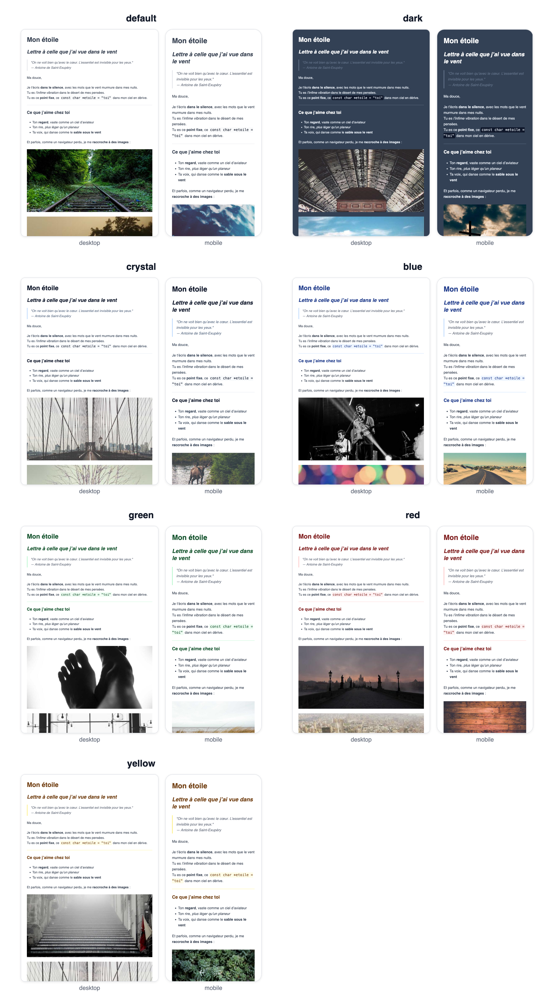

# Inkletter

[](https://github.com/lpauloin/Inkletter)
[](https://github.com/lpauloin/Inkletter/actions/workflows/ci.yml)
[](https://badge.fury.io/py/inkletter)
[](https://opensource.org/licenses/MIT)

**Write your emails like prose, send them like a pro.**

Inkletter is a magical little tool that transforms your plain Markdown files into beautiful, 
responsive MJML and HTML email layouts, ready to be previewed, shared or sent to the world.

## Why Inkletter?

Because writing HTML emails by hand is like ironing socks: pointless and painful.

With Inkletter, you write your content in **Markdown** (like a decent human being), 
and we turn it into **gorgeous, mobile-friendly HTML emails** powered by MJML.

Built with care, clarity and just enough elegance, 
the kind that pairs well with good typography and strong espresso.

## Features

- ✅ Convert Markdown to MJML
- ✅ Convert Markdown to full responsive HTML
- ✅ Live preview in your browser
- ✅ Device simulator (iPhone, iPad, Desktop, etc.)
- ✅ One command, zero headache
- ✅ No vendor lock-in, fully offline

## ✨ Live Samples

Explore the included examples to see Inkletter in action:
- 🔍 [sample.md](sample/sample.md) — the original Markdown source
- 💎 [sample.html](sample/sample.html) — the final responsive HTML output
- 🎨 [preview.html](sample/preview.html) — the interactive split preview (Markdown / MJML / Rendered)

## Installation

Make sure you have Python 3.10+ installed on your system.

Then in your terminal:

```bash
pip install inkletter
```

Or for development:

```bash
git clone https://github.com/lpauloin/Inkletter.git
cd Inkletter
pip install -e .
```

## How it works

### 1. Preview your Markdown as a responsive email

```bash
inkletter preview yourfile.md
```

This opens a split view in your browser with:
- Your original Markdown
- The generated MJML
- A live rendered email with responsive device preview

Yes, even iPhone 14. You’re welcome.


### 2. Convert and export to HTML

```bash
inkletter md2html input.md -o output.html --view
```

This will:
- Convert the Markdown to MJML
- Render it into clean HTML
- Save the HTML to `output.html`
- Optionally open it in your browser with `--view`

### 3. Export the raw MJML

```bash
inkletter md2mjml input.md -o output.mjml
```

Without `-o`, the MJML is printed to stdout, ready to be piped anywhere.

No fuss. No noise. Just results.

## Theming

Every command accepts `--theme` with a **built-in preset** or a **TOML file**:

```bash
inkletter preview newsletter.md --theme dark
inkletter md2html newsletter.md --theme mytheme.toml -o out.html
inkletter md2mjml newsletter.md --no-theme   # bare MJML, no styling
```

Built-in presets: `default`, `dark`, `crystal`, `blue`, `green`, `red`, `yellow` — see them applied to [sample.md](sample/sample.md) in [sample/themes/](sample/themes/):



A theme file is partial — set only what you want to change:

```toml
[layout]
width = "640px"

[text]
font_family = "Georgia, serif"

[links]
color = "#c0392b"
underline = false
```

Or from Python, with the same defaults and optional named palettes:

```python
from inkletter.colors import Blue
from inkletter.md_to_html import parse_markdown_to_html
from inkletter.theme import Links, Text, Theme

theme = Theme(text=Text(font_family="Georgia, serif"), links=Links(color=Blue.DARK))
html = parse_markdown_to_html(markdown, theme=theme)
```

Sections and keys: `[layout]` (width, background_color, content_background_color, section_padding), `[text]` (font_family, font_size, line_height, color), `[headings]` (font_family, color, font_weight, h1_size, h2_size, h3_size), `[links]` (color, underline), `[code]` (font_family, background_color, color), `[quote]` (color, border_color, font_style), `[divider]` (color, width), `[table]` (border_color, cell_padding, header_color, header_background_color). Any unknown key fails loudly with the list of valid ones.


## Contributing

French or not, you are welcome to contribute.
Fork it, branch it, test it, PR it — with love.

To run the test suite locally:

```bash
pip install -r requirements-test.txt
pytest
```

Every push and pull request is checked by the GitHub Actions CI on Python 3.10 to 3.13.

## License

MIT — but don’t forget to say “merci” 😉

### Made with ❤️ and `markdown` in France.
